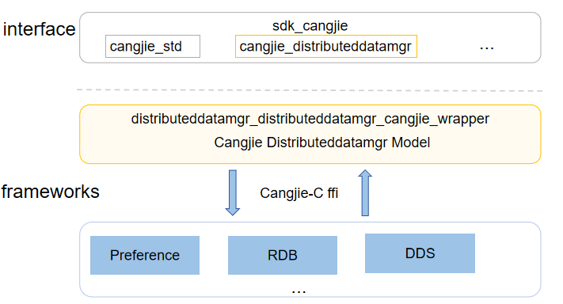

# distributeddatamgr_cangjie_wrapper

## Introduction

The distributeddatamgr_cangjie_wrapper is a Cangjie API encapsulated on OpenHarmony based on the capabilities of the DistributedDataManager Subsystem. The DistributedDataManager subsystem implements persistence of a variety of structured data on a single device and data sync and sharing across devices. It allows application data to be seamlessly processed across devices, ensuring consistent user experience for the same application across devices.The distributeddatamgr cangjie interface currently under development only supports standard devices.

## System Architecture



**Figure 1** Architecture of the distributeddatamgr_cangjie_wrapper

As shown in the architecture diagram:

-   DataShare Predicates: Provide data sharing predicates for implementing different query methods.
-   Distributed KV Store: Provide distributed collaboration capabilities for databases between different devices.
-   User Preferences: Provide Key-Value type data processing capabilities.
-   RDB Store: Provide a complete mechanism for managing local databases.
-   Value Bucket: Provide a collection of data to be inserted into the database.
-   Cangjie distributed data management FFI interface definition: Responsible for defining the C interoperability Cangjie interface, which is used to realize the Cangjie distributed data management capabilities.
-   DataShare Component: Provide data sharing predicate capabilities, and providing the package C interface to Cangjie for interoperability.
-   KV Store Component: Provide distributed collaboration capabilities for databases between different devices, and providing the package C interface to Cangjie for interoperability.
-   Preferences Component: Provide Key-Value type data processing capabilities, and providing the package C interface to Cangjie for interoperability.
-   Relational Database: Provide local database management mechanisms, and providing the package C interface to Cangjie for interoperability.

## Directory Structure

The structure of the repository directory is as follows:

```
foundation/distributeddatamgr/distributeddatamgr_cangjie_wrapper
├── figures          # architecture pictures
├── kit              # Cangjie kit code
│   └── ArkData
└── ohos             # Cangjie DistributedDataManager code
    └── data
```

## Usage

The distributeddatamgr_cangjie_wrapper provides the following capabilities:

-   DataShare Predicates.
-   Distributed KV Store.
-   User Preferences.
-   RDB Store.
-   Value Bucket.

Compared to ArkTS, the following features are currently not supported:

-   Common Data Types.
-   DataAbility Predicates.
-   DataShare.
-   Distributed Data Object.
-   Shared User Preferences.
-   Shared RDB Store.
-   Unified Data Channel.
-   Uniform Data Structs.
-   Uniform Data Definition and Description.
-   ArkData Intelligence Platform.
-   DataShare ExtensionAbility.
-   Device-Cloud Service.
-   Device-Cloud Sharing Extension.
-   DataShare Result Set.

For distributeddatamgr APIs, please refer to
1. [ohos.data.data_share_predicates](https://gitcode.com/openharmony-sig/arkcompiler_cangjie_ark_interop/blob/master/doc/API_Reference/source_en/apis/ArkData/cj-apis-data_share_predicates.md)
2. [ohos.data.distributed_kv_store](https://gitcode.com/openharmony-sig/arkcompiler_cangjie_ark_interop/blob/master/doc/API_Reference/source_en/apis/ArkData/cj-apis-distributed_kv_store.md)
3. [ohos.data.preferences](https://gitcode.com/openharmony-sig/arkcompiler_cangjie_ark_interop/blob/master/doc/API_Reference/source_en/apis/ArkData/cj-apis-preferences.md)
4. [ohos.data.relational_store](https://gitcode.com/openharmony-sig/arkcompiler_cangjie_ark_interop/blob/master/doc/API_Reference/source_en/apis/ArkData/cj-apis-relational_store.md)
5. [ohos.data.values_bucket](https://gitcode.com/openharmony-sig/arkcompiler_cangjie_ark_interop/blob/master/doc/API_Reference/source_en/apis/ArkData/cj-apis-values_bucket.md)

For relevation guidance, please refer to [Database Development Guide](https://gitcode.com/openharmony-sig/arkcompiler_cangjie_ark_interop/blob/master/doc/Dev_Guide/source_en/database)

## Code Contribution

Developers are welcome to contribute code, documentation, etc. For specific contribution processes and methods, please refer to [Code Contribution](https://gitcode.com/openharmony/docs/blob/master/en/contribute/code-contribution.md).

## Repositories Involved

[distributeddatamgr\_data_share](https://gitee.com/openharmony/distributeddatamgr_data_share)

[distributeddatamgr\_kv_store](https://gitee.com/openharmony/distributeddatamgr_kv_store)

[distributeddatamgr\_preferences](https://gitee.com/openharmony/distributeddatamgr_preferences)

[distributeddatamgr\_relational_store](https://gitee.com/openharmony/distributeddatamgr_relational_store)
