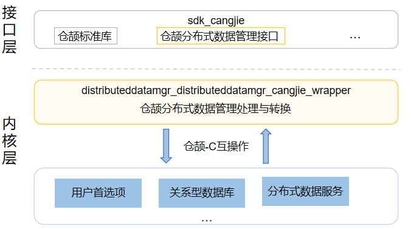

# 分布式数据管理仓颉封装

## 简介

分布式数据管理仓颉封装是在OpenHarmony上面对开发者使用仓颉语言进行应用开发时提供的各种结构化数据的持久化，以及跨设备之间数据的同步、共享功能。开发者通过分布式数据管理仓颉封装，能够方便地完成应用程序数据在不同终端设备间的无缝衔接，满足用户跨设备使用数据的一致性体验。当前开发的分布式数据管理仓颉封装仅支持standard设备。

## 系统架构

**图 1**  分布式数据管理仓颉封装架构图



如架构图所示：

接口层：

- 数据共享谓词：面向开发者提供用于实现不同查询方法的数据共享谓词。
- 分布式键值数据库：面向开发者提供键值对数据管理能力。
- 用户首选项：面向开发者提供轻量级Key-Value操作，支持本地应用存储少量数据。
- 关系型数据库：面向开发者提供了一套基于SQLite组件的完整的对本地数据库进行管理的机制。
- 数据集：面向开发者提供可向数据库插入的数据集合。

框架层：

- 数据共享谓词封装：基于底层数据共享部件，实现了查询数据库中数据所使用的筛选条件即谓词，利用谓词可以进行数据的更新、删除和查询。
- 分布式键值数据库封装：基于底层KV数据库部件，实现不同设备间数据库的分布式协同能力，能够将数据保存到分布式键值数据库中，并可对分布式键值数据库中的数据进行增加、删除、修改、查询、端端同步等操作。
- 用户首选项封装：基于底层首选项部件，实现Key-Value键值型的数据处理能力，支持持久化轻量级数据，并对其修改和查询。。
- 关系型数据库封装：基于底层关系型数据库部件，实现了一种基于关系模型来管理数据的数据库，提供了一系列的增、删、改、查等接口，也可以直接运行用户输入的SQL语句来满足复杂的场景需要。
- 数据集封装：实现了仓颉应用向数据库插入的数据集合。

架构图中依赖部件引入说明：

- 数据共享部件：数据共享谓词封装依赖数据共享部件，用于实现查询数据库中数据所使用的筛选条件。
- KV数据库部件：分布式键值数据库封装依赖KV数据库部件，用于实现不同设备间数据库的分布式协同能力。
- 首选项部件：用户首选项封装依赖首选项部件，用于实现轻量级的本地Key-Value键值型的数据处理能力。
- 关系型数据库部件：关系型数据库封装依赖关系型数据库部件，用于实现本地关系型数据库管理机制。
- ability_cangjie_wrapper：分布式键值数据库封装、用户首选项封装以及关系型数据库封装依赖ability_cangjie_wrapper的应用上下文能力，用于访问当前应用的数据库资源等。
- hiviewdfx_cangjie_wrapper：依赖hiviewdfx_cangjie_wrapper提供的HiLog日志能力，用于在关键路径打印日志。
- cangjie_ark_interop：依赖cangjie_ark_interop提供的仓颉注解类定义和BusinessException异常类定义，用于对API进行标注，及在错误分支向用户抛出异常。

## 目录

仓目录结构如下：

```
foundation/communication/netmanager_cangjie_wrapper
├── figures          # 存放README中的架构图
├── kit              # 仓颉kit化代码
│   └── ArkData      # ArkData模块实现
└── ohos             # 仓颉分布式数据管理接口实现
│   └── data
│       ├── data_share_predicates     # 数据共享谓词模块
│       ├── distributed_kv_store      # 分布式键值数据库模块
│       ├── preferences               # 用户首选项模块
│       ├── relational_store          # 关系型数据库模块
│       └── values_bucket             # 数据集模块
└── test             # 测试用例
    ├── data_share_predicates # 数据共享谓词测试用例
    ├── distributed_kv_store  # 分布式键值数据库测试用例
    ├── preferences           # 用户首选项测试用例
    └── relational_store      # 关系型数据库测试用例
```

## 使用说明

如架构图所示，分布式数据管理仓颉封装提供了以下功能：

- 数据共享谓词。
- 分布式键值数据库。
- 用户首选项。
- 关系型数据库。
- 数据集。

分布式数据管理相关接口请参见

1. [数据共享谓词API文档](https://gitcode.com/openharmony-sig/arkcompiler_cangjie_ark_interop/blob/master/doc/API_Reference/source_zh_cn/apis/ArkData/cj-apis-data_share_predicates.md)
2. [分布式键值数据库API文档](https://gitcode.com/openharmony-sig/arkcompiler_cangjie_ark_interop/blob/master/doc/API_Reference/source_zh_cn/apis/ArkData/cj-apis-distributed_kv_store.md)
3. [用户首选项API文档](https://gitcode.com/openharmony-sig/arkcompiler_cangjie_ark_interop/blob/master/doc/API_Reference/source_zh_cn/apis/ArkData/cj-apis-preferences.md)
4. [关系型数据库API文档](https://gitcode.com/openharmony-sig/arkcompiler_cangjie_ark_interop/blob/master/doc/API_Reference/source_zh_cn/apis/ArkData/cj-apis-relational_store.md)
5. [数据集API文档](https://gitcode.com/openharmony-sig/arkcompiler_cangjie_ark_interop/blob/master/doc/API_Reference/source_zh_cn/apis/ArkData/cj-apis-values_bucket.md)

相关开发指导请参见[分布式数据管理开发指南](https://gitcode.com/openharmony-sig/arkcompiler_cangjie_ark_interop/blob/master/doc/Dev_Guide/source_zh_cn/database)

## 约束

与ArkTS提供的API能力相比，暂不支持以下功能：

- 数据通用类型。
- DataAbility谓词。
- 数据共享。
- 分布式数据对象。
- 共享用户首选项。
- 共享关系型数据库。
- 标准化数据通路。
- 标准化数据结构。
- 标准化数据定义与描述。
- 智慧数据平台。
- 数据共享扩展能力。
- 端云服务。
- 端云共享Extension。
- 数据共享结果集。
- 剪贴板。

## 参与贡献

欢迎广大开发者贡献代码、文档等，具体的贡献流程和方式请参见[参与贡献](https://gitcode.com/openharmony/docs/blob/master/zh-cn/contribute/%E5%8F%82%E4%B8%8E%E8%B4%A1%E7%8C%AE.md)。

## 相关仓

[ability_ability_cangjie_wrapper](https://gitcode.com/openharmony-sig/ability_ability_cangjie_wrapper)

[arkcompiler_cangjie_ark_interop](https://gitcode.com/openharmony-sig/arkcompiler_cangjie_ark_interop)

[hiviewdfx_hiviewdfx_cangjie_wrapper](https://gitcode.com/openharmony-sig/hiviewdfx_hiviewdfx_cangjie_wrapper)

[distributeddatamgr\_data_share](https://gitee.com/openharmony/distributeddatamgr_data_share/blob/master/README_zh.md)

[distributeddatamgr\_kv_store](https://gitee.com/openharmony/distributeddatamgr_kv_store/blob/master/README_zh.md)

[distributeddatamgr\_preferences](https://gitee.com/openharmony/distributeddatamgr_preferences/blob/master/README_zh.md)

[distributeddatamgr\_relational_store](https://gitee.com/openharmony/distributeddatamgr_relational_store/blob/master/README_zh.md)
